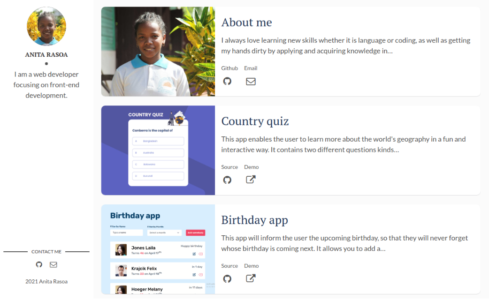
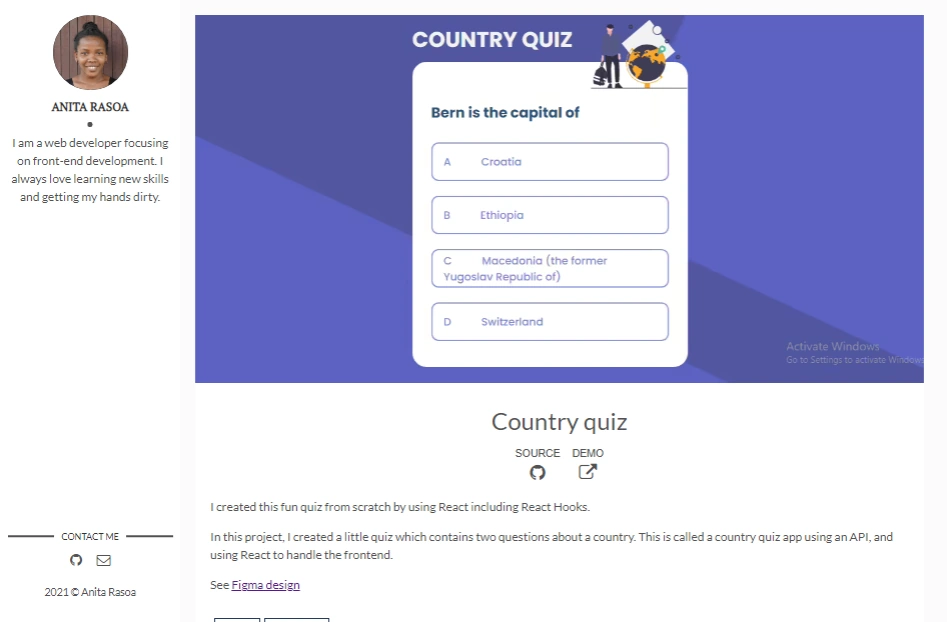

<h1 align="center">
  Anita Portfolio
</h1>

<div align="center">
  <h3>
    <a href="https://github.com/Betsimisaraka/portfolio-gatsby">
      Source code
    </a>
    <span> | </span>
    <a href="https://anita.onja.org/">
      Demo
    </a>
  </h3>
</div>

This portfolio is made with gatsby. I got the template from gatsby and then I modified all of the contents including texts and images.

You can see the list of my projects in the home page and a little bit information about me. Projects details page contains the description, screenshots, link to demo and source code.

## Overview




## Quick Start 🚀

1.  **Create a Gatsby site.**

    Use the Gatsby CLI to create a new site, specifying the default starter.

    ```sh
    # create a new Gatsby site using the-plain-gatsby starter
    gatsby new portfolio-gatsby https://github.com/Betsimisaraka/portfolio-gatsby
    ```

2.  **Start developing.**

    Navigate into your new site’s directory and start it up.

    ```sh
    cd portfolio-gatsby/
    gatsby develop
    ```

3.  **Open the source code and start editing!**

    Your site is now running at `http://localhost:8000`!

    _Note: You'll also see a second link: _`http://localhost:8000/___graphql`_. This is a tool you can use to experiment with querying your data. Learn more about using this tool in the [Gatsby tutorial](https://www.gatsbyjs.org/tutorial/part-five/#introducing-graphiql)._

## Contact

Github [Betsimisaraka](https://github.com/Betsimisaraka)

The portfolio based on https://github.com/wangonya/flexible-gatsby
